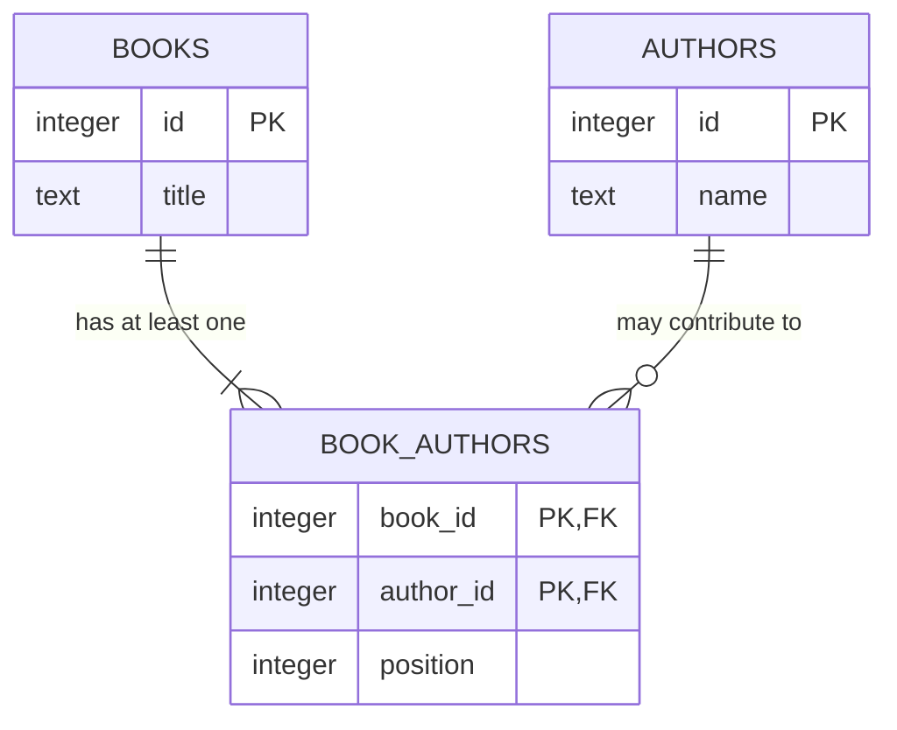

# Book API Database Design

## Scope

This document defines the introductory relational model for books and authors. It describes the logical design before PostgreSQL tables, migrations, or Go database integration are implemented.

The current in-memory API stores an author as text inside each book. The database model changes this because authors have their own identity and a book may have multiple authors.

## Business Rules

- A book has a server-generated, stable ID.
- An author has a server-generated, stable ID.
- Every book has a non-blank title.
- Every author has a non-blank name.
- A book must have at least one author.
- A book may have multiple authors.
- An author may write multiple books.
- An author may exist without being linked to a book.
- Different books may have the same title.
- Different authors may have the same name; a name is not identity.
- The same author cannot be linked to the same book more than once.
- Author credit order is preserved for every book.
- Two authors cannot occupy the same position for one book.
- Deleting a book removes its author relationships but does not delete authors.
- An author cannot be deleted while still linked to any book.
- Creating a book and its author relationships must succeed or fail as one operation.
- Replacing a book's authors must never leave the book with zero authors.

## Entities

### Book

A work stored by the application. Its identity remains stable if its title changes.

### Author

A person credited as an author. An author is stored independently so the same author can be connected to multiple books without copying author data into every book.

### Book Author

The association between one book and one author. This junction entity represents the many-to-many relationship and stores information that belongs to the relationship, such as author position for a particular book.

## Relational Model

### `books`

| Column | Conceptual type | Null? | Key/constraint | Meaning |
|---|---|---:|---|---|
| `id` | generated integer | No | Primary key | Stable book identity |
| `title` | text | No | Must be non-blank | Book title |

`title` is not unique because different books may legitimately share a title.

### `authors`

| Column | Conceptual type | Null? | Key/constraint | Meaning |
|---|---|---:|---|---|
| `id` | generated integer | No | Primary key | Stable author identity |
| `name` | text | No | Must be non-blank | Author's display name |

`name` is not unique because different people may have the same name. Clients must use author IDs when referring to an existing author.

### `book_authors`

| Column | Conceptual type | Null? | Key/constraint | Meaning |
|---|---|---:|---|---|
| `book_id` | integer | No | Primary key part; FK to `books.id` | Related book |
| `author_id` | integer | No | Primary key part; FK to `authors.id` | Related author |
| `position` | integer | No | Positive; unique per book | Author credit order within the book |

The composite primary key `(book_id, author_id)` prevents the same author from being linked to the same book twice.

The unique pair `(book_id, position)` prevents two authors from occupying the same position in one book. A single-author book has one junction row with `position = 1`.

## ER Diagram



Cardinality in plain language:

- One book has one or more `book_authors` rows.
- One author has zero or more `book_authors` rows.
- Every `book_authors` row refers to exactly one book and exactly one author.

The requirement that every book has at least one author is a business invariant. A normal foreign key ensures that junction rows reference real records, but it cannot by itself ensure that every book has a child junction row. The application will enforce this using validation and an atomic transaction. A database trigger could add stricter database-side enforcement later if required.

## Foreign-Key Deletion Behaviour

### Book reference

Conceptually:

```sql
book_authors.book_id REFERENCES books(id) ON DELETE CASCADE
```

Deleting a book automatically deletes its `book_authors` rows. Author rows remain.

### Author reference

Conceptually:

```sql
book_authors.author_id REFERENCES authors(id) ON DELETE RESTRICT
```

Deleting an author is refused while any `book_authors` row references that author. The application must safely remove or replace those relationships first. If an author is a book's only author, another author must be assigned before that relationship can be removed unless the book itself is explicitly deleted.

## Constraint Ownership

| Rule | API validation | Database protection |
|---|---:|---:|
| Title is present and non-blank | Yes | `NOT NULL` plus non-blank `CHECK` |
| Author name is present and non-blank | Yes | `NOT NULL` plus non-blank `CHECK` |
| Referenced book exists | Useful for a clear error | Foreign key |
| Referenced author exists | Yes | Foreign key |
| No duplicate book-author relationship | Yes | Composite primary key |
| Author position is positive | Yes | `CHECK` |
| Position is unique within a book | Yes | Unique `(book_id, position)` |
| Book has at least one author | Yes | Transaction; optional advanced trigger later |
| Linked author cannot be deleted | Clear conflict response | `ON DELETE RESTRICT` |

Application validation gives clients useful errors. Database constraints remain the final protection against invalid data from any application, script, or concurrent request.

## Normalization

### First Normal Form (1NF)

Each column stores one value. Authors are not stored as a comma-separated list inside `books`. Each book-author association has its own row in `book_authors`.

### Second Normal Form (2NF)

`book_authors` uses the composite key `(book_id, author_id)`. Its relationship attribute, `position`, describes that complete book-author association rather than only the book or only the author.

### Third Normal Form (3NF)

- `books.title` describes the book identified by `books.id`.
- `authors.name` describes the author identified by `authors.id`.
- `book_authors.position` describes the relationship identified by `(book_id, author_id)`.
- Author names are not copied into `books` or `book_authors`.

This avoids the original duplicate-data problem: storing an author's name in every book could require many updates when the author name changes and could leave inconsistent spellings. The normalized model updates the author fact in one row.

## API Operation to Data Mapping

### Create an author

```text
input         → non-blank name
tables read   → none required for identity because names are not unique
tables written→ authors
result        → generated author ID and name
```

### Create a book

Input should contain a title and an ordered, non-empty list of existing author IDs.

Within one transaction:

1. Validate that all supplied author IDs exist.
2. Insert the book into `books`.
3. Insert one `book_authors` row per author with its position.
4. Commit only if every step succeeds.

If any author is missing or any relationship is invalid, roll back the entire operation.

### List books

Pagination must count books, not raw joined author rows:

1. Filter, sort, and select the page of distinct books.
2. Fetch all authors for those selected book IDs.
3. Order authors by `book_authors.position`.
4. Group the rows into one API object per book.

Applying `LIMIT` and `OFFSET` directly to raw book-author join rows would allow one multi-author book to consume multiple page slots or split its authors across pages.

### Find a book by ID

Read the matching `books` row and its related `authors` rows through `book_authors`, ordered by position. A missing book returns `404`.

### Filter books by title

Filter `books.title`, then apply deterministic sorting and book-level pagination. Fetch authors for the selected book IDs.

### Filter books by author

Use `book_authors` and `authors` to determine which books match the requested author. After selecting matching books, fetch all authors for those books—not only the author that caused the match.

For example, filtering by Alice may select a book written by Alice and Bob. The returned book must still contain both Alice and Bob.

### Update a book

- If only the title is provided, update `books.title`.
- If authors are omitted, preserve existing relationships.
- If an ordered author-ID list is provided, require at least one valid ID.
- Replace or synchronize `book_authors` rows and positions inside the same transaction as any related book update.
- Roll back if any validation or write fails.

### Delete a book

Delete the `books` row. The `book_id` foreign key cascades deletion to its `book_authors` rows. Authors remain. Return `404` if the book did not exist; otherwise return `204`.

### Delete an author

Allow deletion only when the author has zero `book_authors` rows. `ON DELETE RESTRICT` prevents accidental deletion while relationships exist.

## Atomic Operations

The following future database operations require transactions:

- Creating a book and all its author relationships.
- Replacing a book's author relationships and positions.
- Removing or reassigning an author across books while preserving the rule that every book has an author.

Deleting one book with foreign-key cascade is already atomic as a single database statement.

## Assumptions and Deferred Decisions

- Author names are display names and are not unique identifiers.
- Authors are created separately; book creation refers to existing author IDs.
- The initial model stores only fields required by the current project. ISBN, edition, publication date, description, timestamps, publishers, and soft deletion are deferred until a real requirement exists.
- Exact PostgreSQL integer types and ID-generation syntax will be chosen during schema implementation.
- Index design beyond keys and essential relationship lookups will be studied with real SQL queries later.
- Database-trigger enforcement for the minimum-one-author rule is deferred; application validation and transactions are the initial strategy.

## Design Summary

The model contains two independent entities, `books` and `authors`, connected through the `book_authors` junction table. The junction table resolves the many-to-many relationship, prevents duplicate associations, and stores author credit order. Foreign keys protect references and deletion behaviour. Normalization stores each author fact once, while transactions preserve business rules spanning multiple rows.
